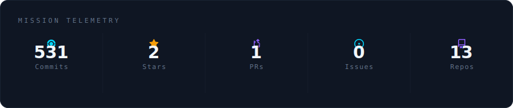

# Hi there, I'm Ivo Fernandes 👋

## 🚀 Who I Am

Full-Stack Developer shipping **production systems that scale and generate revenue**.

From publishing SDKs on NPM to architecting multi-tenant SaaS platforms with billing engines and AI-powered churn prediction — I build at the intersection of scalable architecture, business-critical systems, and AI integration.

Most of my work is in proprietary enterprise products (multi-tenancy, webhook orchestration, async processing with Bull/Redis, biometric SDKs, ML pipelines). The technical challenges are real.

> 💼 **Check my [Portfolio](https://ivo-fernandes.netlify.app/)** for a comprehensive view of what I've built. Most substantial projects are private due to commercial/contractual reasons.

---

## 🌌 Mission Telemetry

---

## 🛠️ Tech Stack & Focus Areas

### What I Actually Build

**SaaS & Business Systems**  
Real production systems with paying customers. Multi-tenant architecture, billing engines, webhook orchestration, async workers (Bull/Redis). Built: recurring payment platforms, retail POS systems, event management SaaS, restaurant automation.

**AI Integration (Not Just Prompts)**  
Practical AI solving real business problems. Churn prediction models, AI-powered customer assistants, intelligent calculators, automated reporting. Stack: OpenAI/Gemini/Claude APIs, n8n workflows, Python/Node.js pipelines.

**Developer Tools & SDKs**  
Building tools other developers use. Published biometric facial recognition SDK on NPM, reusable component libraries. Focus: DX (Developer Experience), TypeScript-first APIs, clean documentation.

**Frontend Architecture**  
Systematic, scalable component libraries. Design Systems, Atomic Design, standardized patterns across products. Stack: React 19, Next.js 15, TypeScript, Tailwind CSS, Shadcn/UI.

---

## 🌠 Featured Systems

---

## 💬 Let's Connect

Open to discussing system architecture, SaaS development, AI integration, or collaboration opportunities.

  
_Code is poetry written in logic._ ✨

---

Powered by <a href="https://github.com/vinimlo/galaxy-profile">Galaxy Profile</a>

